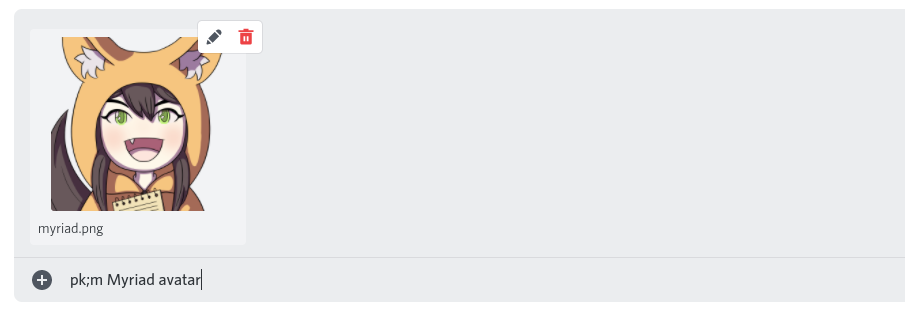

# How to read this
Words in **\<angle brackets>** or **[square brackets]** mean fill-in-the-blank. Square brackets mean this is optional. Don't include the actual brackets.

## Special arguments
Some arguments indicate the use of specific Discord features. These include:

- `@mention`: insert a Discord mention (or "ping")

::: details Mention example

:::

- `reply`: reply to a previous message

::: details Message reply example

:::

- `upload`: upload a file

::: details Upload example

:::

# Non-prefixed commands

Some bot commands do not use the `pk;` prefix:

- `[tag]` e.g. `S: message` - if `pk;system proxy` is on, proxy this message, based on configured member proxy tags
- `\` - if autoproxy is enabled: as a one-off exception, don't proxy this message, without changing latch/switch/autoproxy
- `\\` - if autoproxy latch is enabled: don't proxy this message, and clear latch status, without disabling autoproxy

# Commands

::: tip
You can have a space after `pk;`, e.g. `pk;system` and `pk; system` will do the same thing.
:::

## System commands
*To target a specific system, replace `[system]` with that system's 5 or 6 character ID, a Discord account ID, or a @mention - note that system names can not be used here. If no system ID is specified, defaults to targeting your own system. For most commands, adding `-clear` will clear/delete the field.*
- `pk;system [system]` - Shows information about a system.
- `pk;system new [name]` - Creates a new system registered to your account.
- `pk;system [system] rename [new name]` - Changes the name of your system.
- `pk;system [system] servername [servername]` - Changes the name of your system in the current server.
- `pk;system [system] description [description]` - Changes the description of your system.
- `pk;system [system] avatar [avatar url|@mention|upload]` - Changes the avatar of your system.
- `pk;system [system] serveravatar [avatar url|@mention|upload]` - Changes the avatar of your system in the current server.
- `pk;system [system] banner [image url|upload]` - Changes your system's banner image.
- `pk;system [system] color [color]` - Changes your system's color.
- `pk;system [system] privacy` - Displays your system's current privacy settings.
- `pk;system [system] privacy <subject> <public|private>` - Changes your systems privacy settings.
- `pk;system [system] tag [tag]` - Changes the system tag of your system.
- `pk;system [system] servertag [tag|-enable|-disable]` - Changes your system's tag in the current server, or disables it for the current server.
- `pk;system [system] pronouns [pronouns]` - Changes the pronouns of your system.
- `pk;system proxy [server id] [on|off]` - Toggles message proxying for a specific server.
- `pk;system [system] delete` - Deletes your system.
- `pk;system [system] fronter` - Shows the current fronter of a system.
- `pk;system [system] fronthistory` - Shows the last 10 fronters of a system.
- `pk;system [system] frontpercent [timeframe]` - Shows the aggregated front history of a system within a given time frame.
- `pk;system [system] list` - Shows a paginated list of a system's members.
- `pk;system [system] list -full` - Shows a paginated list of a system's members, with increased detail.
- `pk;find <search term>` - Searches members by name.
- `pk;system [system] find <search term>` - (same as above, but for a specific system)
- `pk;system [system] random [-group]` - Shows the info card of a randomly selected member [or group] in a system.
- `pk;system [system] id` - Prints a system's id. 

## Member commands
*Replace `<member>` with a member's name, 5 or 6 character ID, or display name. For most commands, adding `-clear` will clear/delete the field.*
- `pk;member <member>` - Shows information about a member.
- `pk;member new <name>` - Creates a new system member.
- `pk;member <member> rename <new name>` - Changes the name of a member.
- `pk;member <member> displayname <new display name>` - Changes the display name of a member.
- `pk;member <member> servername <new server name>` - Changes the display name of a member, only in the current server.
- `pk;member <member> description [description]` - Changes the description of a member.
- `pk;member <member> avatar [avatar url|@mention|upload]` - Changes the avatar of a member.
- `pk;member <member> proxyavatar [avatar url|@mention|upload]` - Changes the avatar used for proxied messages sent by a member.
- `pk;member <member> serveravatar [avatar url|@mention|upload]` - Changes the avatar of a member in a specific server.
- `pk;member <name> banner [image url|upload]` - Changes the banner image of a member.
- `pk;member <member> privacy` - Displays a members current privacy settings.
- `pk;member <member> privacy <subject> <public|private>` - Changes a members privacy setting.
- `pk;member <member> proxy [tags]` - Changes the proxy tags of a member. use below add/remove commands for members with multiple tag pairs.
- `pk;member <member> proxy add [tags]` - Adds a proxy tag pair to a member.
- `pk;member <member> proxy remove [tags]` - Removes a proxy tag from a member.
- `pk;member <member> autoproxy [on|off]` - Sets whether a member will be autoproxied when autoproxy is set to latch or front mode.
- `pk;member <member> keepproxy [on|off]` - Sets whether to include a member's proxy tags in the proxied message.
- `pk;member <member> serverkeepproxy [on|off|clear]` - Sets whether to include a member's proxy tag in the proxied message in a specific server.
- `pk;member <member> tts [on|off]` - Sets whether to send a member's messages as text-to-speech messages.
- `pk;member <member> pronouns [pronouns]` - Changes the pronouns of a member.
- `pk;member <member> color [color]` - Changes the color of a member.
- `pk;member <member> birthdate [birthdate|today]` - Changes the birthday of a member.
- `pk;member <member> delete` - Deletes a member.
- `pk;member <member> id` - Prints a member's id. 

## Group commands
*Replace `<group>` with a group's name, 5 or 6 character ID, or display name. For most commands, adding `-clear` will clear/delete the field.*
- `pk;group <group>` - Shows information about a group.
- `pk;group new <name>` - Creates a new group.
- `pk;group list` - Lists all groups in your system.
- `pk;group <group> list` - Lists all members in a group.
- `pk;group <group> random` - Shows the info card of a randomly selected member in a group.
- `pk;group <group> rename <new name>` - Renames a group.
- `pk;group <group> displayname [display name]` - Shows or changes a group's display name.
- `pk;group <group> description [description]` - Shows or changes a group's description.
- `pk;group <group> add <member> [member 2] [member 3...]` - Adds one or more members to a group.
- `pk;group <group> remove <member> [member 2] [member 3...]` - Removes one or more members from a group.
- `pk;group <group> privacy <name|description|icon|visibility|metadata|all> <public|private>` - Changes a group's privacy settings.
- `pk;group <group> icon [icon url|@mention|upload]` - Shows or changes a group's icon.
- `pk;group <group> color [color]` - Shows or changes a group's color.
- `pk;group <group> random` - Shows a random member from a group.
- `pk;group <group> banner [image url|upload]` - Shows or changes a group's banner image.
- `pk;group <group> delete` - Deletes a group.
- `pk;group <group> id` - Prints a group's id. 

## Switching commands
- `pk;switch [member...]` - Registers a switch with the given members.
- `pk;switch out` - Registers a 'switch-out' - a switch with no associated members.
- `pk;switch edit <member...|out>` - Edits the members in the latest switch.
- `pk;switch copy <member...>` - Makes a new switch based off the current switch with the listed members added or removed.
- `pk;switch move <time>` - Moves the latest switch backwards in time.
- `pk;switch delete` - Deletes the latest switch.
- `pk;switch delete all` - Deletes all logged switches.

## Autoproxy commands
- `pk;autoproxy off` - Disables autoproxying for your system in the current server.
- `pk;autoproxy front` - Sets your system's autoproxy in this server to proxy the first member currently registered as front.
- `pk;autoproxy latch` - Sets your system's autoproxy in this server to proxy the last manually proxied member.
- `pk;autoproxy \<member>` - Sets your system's autoproxy in this server to proxy a specific member.

## Config commands
- `pk;config timezone [location]` - Changes the time zone of your system.
- `pk;config ping <enable|disable>` - Changes your system's ping preferences.
- `pk;config autoproxy timeout [<duration>|off|reset]` - Sets the latch timeout duration for your system.
- `pk;config autoproxy account [on|off]` - Toggles autoproxy globally for the current account.
- `pk;config proxy case [on|off]` - Toggles case sensitive proxy tags for your system.
- `pk;config private member [on|off]` - Toggles whether member privacy is automatically set to private for new members.
- `pk;config private group [on|off]` - Toggles whether group privacy is automatically set to private for new groups.
- `pk;config show private [on|off]` - Toggles whether private information is shown to linked accounts by default.
- `pk;config proxy error [on|off]` - Toggles whether to send an error message when proxying fails.
- `pk;config split IDs [on|off]` - Toggles whether to display 6-letter IDs with a hyphen, to ease readability.
- `pk;config capitalize IDs [on|off]` - Toggles whether to display IDs as capital letters, to ease readability.
- `pk;config pad IDs [left|right|off]` - Toggles whether to pad (add a space) 5-character IDs in lists.
- `pk;config show color [on|off]` - Toggles whether to show color codes in system/member/group cards
- `pk;config proxy switch [new|add|off]` - Toggles whether to log a switch whenever you proxy as a different member (or add member to recent switch in add mode).
- `pk;config name format [format]` - Changes your system's username formatting.
- `pk;config server name format [format]` - Changes your system's username formatting for the current server.

## Server owner commands
*(all commands here require Manage Server permission)*
- `pk;serverconfig log cleanup [on|off]` - Toggles whether to clean up other bots' log channels
- `pk;serverconfig invalid command error [on|off]` - Sets whether to show an error message when an unknown command is sent
- `pk;serverconfig require tag [on|off]` - Sets whether server users are required to have a system tag on proxied messages
- `pk;serverconfig suppress notifications [on|off]` - Sets whether all proxied messages have push notifications suppressed (sent as `@silent` messages)
- `pk;serverconfig log channel <channel>` - Designates a channel to post proxied messages to
- `pk;serverconfig log channel -clear` - Clears the currently set log channel
- `pk;serverconfig log blacklist`- Displays the current list of channels where logging is disabled
- `pk;serverconfig log blacklist add all|<channel> [channel 2] [channel 3...]` - Disables message logging in certain channels
- `pk;serverconfig log blacklist remove all|<channel> [channel 2] [channel 3...]` - Enables message logging in certain channels
- `pk;serverconfig proxy blacklist` - Displays the current proxy blacklist
- `pk;serverconfig proxy blacklist add all|<channel> [channel 2] [channel 3...]` - Adds certain channels to the proxy blacklist
- `pk;serverconfig proxy blacklist remove all|<channel> [channel 2] [channel 3...]` - Removes certain channels from the proxy blacklist
- `pk;serverconfig command blacklist` - Displays the current command blacklist
- `pk;serverconfig command blacklist add all|<channel> [channel 2] [channel 3...]` - Adds certain channels to the command blacklist
- `pk;serverconfig command blacklist remove all|<channel> [channel 2] [channel 3...]` - Removes certain channels from the command blacklist

## Utility
- `pk;message <message id|message link|reply>` - Looks up information about a proxied message by its message ID or link.
- `pk;invite` - Sends the bot invite link for PluralKit.
- `pk;import` - Imports a data file from PluralKit or Tupperbox.
- `pk;export` - Exports a data file containing your system information.
- `pk;debug permissions [server id]` - [Checks the given server's permission setup](/staff/permissions/#permission-checker-command) to check if it's compatible with PluralKit.
- `pk;debug proxying <message link|reply>` - Checks why your message has not been proxied.
- `pk;edit [message link|reply] <new content>` - Edits a proxied message. Without an explicit message target, will target the last message proxied by your system in the current channel. **Does not support message IDs!**
- `pk;edit -regex [message link|reply] <regex>` - Edits a proxied message using a C# regex. The given regex must be formatted like s\|X\|Y or s\|X\|Y\|F, where \| is any character, X is a regex pattern, Y is a substitution string, and F is a set of flags.
- `pk;reproxy [message link|reply] <member name|ID>` - Reproxies a message using a different member. Without an explicit message target, will target the last message proxied by your system in the current channel. Only works on the last message, or within 1 minute of the proxied message being sent. Doesn't work on a non-proxied message.
- `pk;link <account>` - Links your system to a different account.
- `pk;unlink [account]` - Unlinks an account from your system.
- `pk;random [-group]` - Shows the card of a random member or group from your system.

## API
*(for using the [PluralKit API](/api), useful for developers)*
- `pk;token` - DMs you a token for using the PluralKit API.
- `pk;token refresh` - Refreshes your API token and invalidates the old one.
- `pk;s webhook [url]` - Shows or updates the [dispatch webhook](/api/dispatch) URL for your system.

## Help
- `pk;help` - Displays a basic help message describing how to use the bot.
- `pk;help proxy` - Directs you to [this page](/guide/#proxying).
- `pk;system help` - Lists system-related commands.
- `pk;member help` - Lists member-related commands.
- `pk;switch help` - Lists switch-related commands.
- `pk;commands` - Shows inline command documentation, or directs you to this page.
