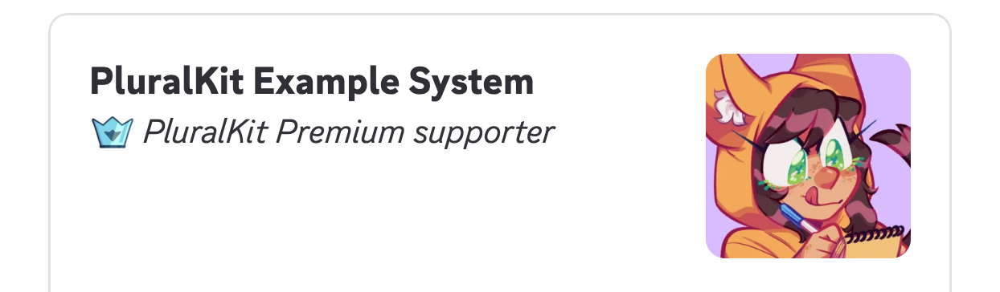

## Announcing PluralKit Premium

As we've teased earlier in [the support server](https://discord.gg/PczBt78),
we will be adding a "premium" subscription tier to PluralKit. We do want to
assure everyone, however, that **the bot will always be free to use, and no
existing features (or new core features) will ever be paywalled.**

Our goal for PK Premium is to have the income from subscriptions cover all the
running costs of the bot - which, up until now, has been paid for partly by
donations to our Patreon / Buy Me A Coffee; and partly out of the pockets of
the developers.

PluralKit Premium will cost **US$5/month** (plus tax), and will be **launching
before the end of February 2026**.

PluralKit Premium will offer both cosmetic perks, and "power user" features.
At launch, PK Premium will offer the following:

- the ability to set custom system/member/group IDs,
- lossless, higher resolution image hosting on PluralKit's CDN,
- the ability to upload avatars/banners directly from the PluralKit Dashboard,
- and a badge on your PluralKit system card to show off your support.

We will be adding more perks to PK Premium in future - including, but not
limited to:
- more description customisation options,
- automatic regex-based proxy text substitution,
- and more!

### FAQs

#### I didn't read any of the stuff above, give me a tl;dr!

- PK Premium is launching before the end of February 2026, at US$5/month (+ tax)
- No existing features, or new core features, will be paywalled - the premium
  subscription offers cosmetic perks and power-user features only
- Features at launch include custom IDs; high-resolution image hosting; and
  direct image upload from the web dashboard
- More premium features are still to come!

#### Can I pay yearly?

Yes, there will be a yearly subscription option. There is no discount for paying
yearly.

#### Can I gift a PK Premium subscription to someone?

Not at launch, but we will likely be revisiting this in future.

#### How will ID changes work?

There will be bot commands for changing your own system, member, and group IDs.

Each month of PK Premium you pay for will grant you a number of ID change "tokens,"
and each ID you change uses one of those "tokens." The exact number of ID changes
you will get each month has not yet been confirmed, but they will stack over time.

In addition to the "token" system, to ensure fairness, there is a cap on the number
of IDs you can change in a 24-hour period.

#### Can I transfer custom IDs to another system?

No, sorry.

#### If I subscribe; customise my IDs; and then cancel, do I keep my custom IDs?

Yes!

#### How does this affect PluralKit being open source?

PluralKit will remain open source, and there is no change to the licensing.
Premium features are included in the open source code.

#### I have another question!

Please ask in [#bot-support in the PluralKit support server](https://discord.gg/PczBt78),
and we'll update this FAQ!
