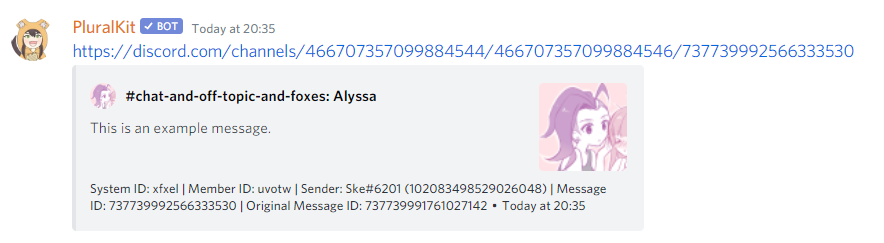

# Proxy logging
If you want to log every proxied message to a separate channel for moderation purposes, you can use the `pk;log` command with the channel name.For example:

    pk;log #proxy-log
    
This requires you to have the *Manage Server* permission on the server. To disable logging, use the `pk;log` command with no channel name.

Log messages have the following format:

## Blacklisting channels from logging
Depending on your server setup, you may want to exclude some messages from logging. For example, if you have public proxy logs, you may want to exclude staff-only channels.

To manage logging in a channel, use the following commands:

    pk;log disable #some-secret-channel
    pk;log enable #some-secret-channel